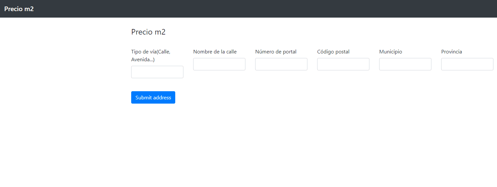

# App to know the squared meter price in Madrid based on location



<p align="center">
<a href="https://geolocator-flask-app.herokuapp.com/" target="blank">
    
</a>  

## Usage

0. Install [anaconda](https://www.anaconda.com/products/individual).

1. Create a virtual environment:

```bash
conda create -n env_geolocator python=3.7
conda activate env_geolocator
```
2. Clone this repository

```bash
git clone https://github.com/jmonsalverodilla/Geolocator.git
cd Geolocator
```

3. Install requirements:

```bash
pip install -r requirements.txt
```

4. Run the app:

```bash
python main.py
```

## License

This repo is under the [MIT License](LICENSE).